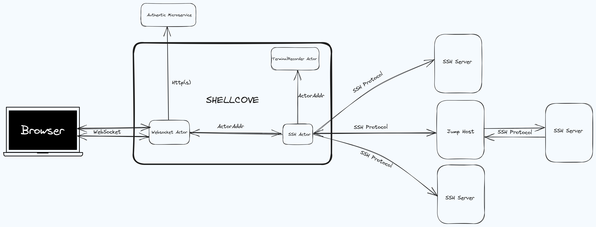

# Shellcove

> **_NOTE_** WIP

## Overview

Shellcove is a Rust-based microservice designed to function as an SSH gateway between broswer base 
Terminal emulators and ssh servers. It enables shell terminals to communicate with the service 
using WebSockets. The service then forwards the requests to an SSH server using the SSH protocol.



## Road Map

- [ ] Record Terminal Session
- [ ] Resumable Sessions
- [x] Acts as a bridge between browser websocket connections and SSH servers
- [ ] Supports secure and encrypted communication.
- [ ] Easy to deploy and integrate with existing systems.
- [ ] container image provided
- 
<!-- - [ ] Lightweight and designed for high performance. -->

## Installation

1. Clone the repository:

```bash
git clone https://github.com/talk2drys/shellcove.git
```

2. Build the project:

```bash
cd shellcove
cargo build --release
```

3. Run the service:

```bash
./target/release/shellcove
```

## Configuration
[comment]: <> (add configuration details)


## Usage

1. Start the Shellcove service:

```bash
./target/release/shellcove
```

2. Connect to the WebSocket server using a shell terminal client that supports WebSocket connections.

   Example using `websocat`:

   ```bash
   websocat ws://localhost:8080
   ```

## License

This project is licensed under the [MIT License](LICENSE).
